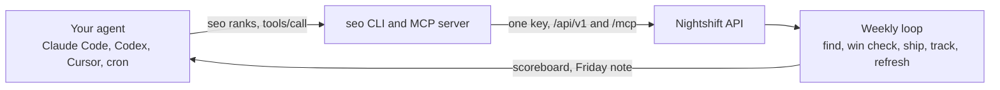

# seo-cli

The command line and MCP server for Nightshift, the SEO operator that runs while you sleep. One key, every SEO number your agent needs.

[](https://www.npmjs.com/package/@truestandard/seo-cli)
[](https://github.com/truestandard/seo-cli/actions/workflows/ci.yml)
[](.nvmrc)
[](LICENSE)

`seo` is a thin client. Every command maps to one Nightshift API call and prints a table. Add `--json` for the raw response. `seo mcp` turns the same key into an MCP server for Claude Code, Codex and Cursor.

## Quickstart

Sixty seconds from install to your first rank read.

```
npm i -g @truestandard/seo-cli
```

```
seo login
```

Asks for the Nightshift URL and your key, checks them, and saves both to `~/.config/seo/config.json`.

```
seo projects
seo use my-site
```

Lists your projects and picks one as the default.

```
seo ranks --since 7d
```

Prints each tracked keyword with position, previous position, change and URL. One summary line follows: top 10, top 20, top 100, unranked and average position.

```
seo mcp
```

Runs the same key as a stdio MCP server. Your agent gets every tool Nightshift serves.

## Add it to your agent

The MCP server fetches the tool list from Nightshift at startup and proxies each call. It reads the same config as the CLI and fills in your default project when a tool wants one.

Claude Code:

```
claude mcp add seo -- seo mcp
```

Codex (`~/.codex/config.toml`):

```toml
[mcp_servers.seo]
command = "seo"
args = ["mcp"]
```

Cursor (`.cursor/mcp.json`):

```json
{
  "mcpServers": {
    "seo": {
      "command": "seo",
      "args": ["mcp"]
    }
  }
}
```

Set `SEO_TOKEN` and `SEO_BASE_URL` in the agent's environment if you want nothing on disk.

## Commands

Commands marked paid call a data provider through Nightshift. Add `--dry-run` to see the estimate first.

### Project

| Command | Does |
|---|---|
| `seo login [--token] [--base-url]` | check the URL and key, then save them |
| `seo projects` | list projects |
| `seo use <slug>` | set the default project |
| `seo project show [slug]` | show a project |
| `seo project create <slug>` | create a project |
| `seo context get` | print the project memory |
| `seo context set <key> [text]` | set a memory section (reads stdin when text is omitted) |
| `seo context add-competitor <domain>` | add a competitor |
| `seo context add-page <path>` | add a key page |
| `seo context log <kind> <summary>` | append a research log entry |

### Research

| Command | Does | Paid |
|---|---|---|
| `seo research <seeds...> --limit --max-kd [--keywords]` | keyword ideas from seed terms with volume and difficulty | yes |
| `seo serp <keyword> --depth` | page one for a keyword, read live | yes |
| `seo floor <keywords...>` | win check: the weakest site on page one against your own, measured in linking sites | yes |
| `seo domain [domain] --limit --force` | traffic, keyword count, top keywords and top pages for any domain | yes, cached 12h |
| `seo backlinks [domain] --history --months --rows` | backlinks and linking sites, with monthly history and the top linking sites | yes |

### Tracking

| Command | Does | Paid |
|---|---|---|
| `seo keywords list [--set]` | the keywords you track | |
| `seo keywords add <kw...> --track --path --set --locked` | add keywords with a target path | |
| `seo keywords update <id> --path --track --status` | change a keyword | |
| `seo keywords remove <id...>` | remove keywords | |
| `seo track run --live or --scheduled [--set]` | start a rank check | yes |
| `seo track status <id>` | how a run is going | |
| `seo ranks --since 7d [--set]` | position, previous, change and URL per keyword, plus a summary line | |
| `seo gsc import <csv> --dimension query or page --start --end` | import a Search Console export | |
| `seo gsc striking` | page-two keywords (position 8 to 20) by impressions | |

### AI answers

| Command | Does | Paid |
|---|---|---|
| `seo prompts list [--set]` | the prompts you ask the engines | |
| `seo prompts add <text...> --set --locked [--file]` | add prompts | |
| `seo ai run [--set] [--runs]` | ask GPT, Claude and Gemini every prompt and score each answer | yes |
| `seo ai results --since 30d [--set]` | named, cited and change since the last run, per engine | |
| `seo ai status <id>` | how a scan is going | |
| `seo mentions [--brand] [--competitor <name>]... [--force]` | how often ChatGPT and Google AI name your brand and each rival | yes, cached 24h |

### Site

| Command | Does | Paid |
|---|---|---|
| `seo audit run [--lighthouse --pages 20] [--max-pages 500]` | crawl the sitemap, key pages and retired paths | Lighthouse only |
| `seo audit show <id>` | summary, issues with severity and fix, Lighthouse scores | |
| `seo audit list` | past audits, newest first | |
| `seo ship <url> --keyword --track --note` | log a shipped page and confirm it answers 200 with an h1 | |
| `seo experiments list` | the change log | |
| `seo experiments add <change> --page --hypothesis --keyword` | log a change and why | |
| `seo experiments outcome <id> <text>` | log what happened | |
| `seo log --kind --days` | research log entries | |

### Spend

| Command | Does |
|---|---|
| `seo scoreboard` | targets, rank summary, AI answers, ships and 30-day spend |
| `seo spend --since 30d` | spend by provider |
| `seo estimate <command> [args...]` | run a paid command with dry_run and print only the estimate |

### Global options

| Option | Effect |
|---|---|
| `--json` | print the raw API response |
| `--project <slug>` | override the default project |
| `--dry-run` | paid commands print the estimate and spend nothing |
| `--base-url <url>` | override the Nightshift URL |

Exit code is 1 on any API error. The message and code go to stderr.

## How it works



The CLI holds no logic of its own. Nightshift runs the loop for every project. The CLI and the MCP server are two doors into the same numbers.

## Costs and estimates

Paid commands buy data from providers through Nightshift. Every paid command takes `--dry-run`. It prints the estimate and spends nothing:

```
seo floor "seo cli" "rank tracker api" --dry-run
seo estimate track run --live
```

`seo spend --since 30d` shows what you spent and where. `seo domain` and `seo mentions` cache results (12 hours and 24 hours). A cached read costs nothing. Add `--force` to buy fresh data.

## Get a key

Sign up at [nightshift.so/signup](https://nightshift.so/signup). One key covers every project on your account.

Self-hosting the backend is not public yet. The CLI talks to Nightshift only.

## Configuration

`seo login` writes `~/.config/seo/config.json`:

```json
{ "baseUrl": "https://…", "token": "seo_…", "project": "my-site" }
```

| Variable | Overrides |
|---|---|
| `SEO_BASE_URL` | `baseUrl` |
| `SEO_TOKEN` | `token` |
| `SEO_PROJECT` | `project` |
| `SEO_CONFIG_PATH` | the config file path |

Non-interactive login for CI: `seo login --token seo_… --base-url https://…`.

## Development

```
git clone git@github.com:truestandard/seo-cli.git
cd seo-cli
npm install
npm test
npm run dev -- ranks --since 7d
```

`npm run typecheck` and `npm run build` complete the set. Three runtime dependencies: `commander`, `@modelcontextprotocol/sdk` and `zod`. The HTTP client is global `fetch`.

## Contributing

Read [CONTRIBUTING.md](CONTRIBUTING.md) for setup and the pull request checklist.

## Security

Read [SECURITY.md](SECURITY.md). Report vulnerabilities to security@truestandard.ai.

## License

[MIT](LICENSE)

---

Built by [TrueStandard Labs](https://truestandard.ai). Nightshift lives at [nightshift.so](https://nightshift.so).
