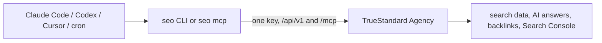

# seo-cli

The command line and MCP server for TrueStandard Agency, the SEO operator that runs the loop for you: find the terms you can win, check the target, ship the page, track the rank and the AI answers every week.

[](https://github.com/truestandard/seo-cli/actions/workflows/ci.yml)
[](go.mod)
[](LICENSE)

One static binary. Every command maps to one API call and prints JSON. Add `--pretty` for tables. `seo mcp` turns the same key into an MCP server for Claude Code, Codex and Cursor.

## Install

Release archives for macOS and Linux:

```
curl -fsSL https://github.com/truestandard/seo-cli/releases/latest/download/seo_$(uname -s)_$(uname -m).tar.gz | tar -xz -C /usr/local/bin seo
```

Or from source with Go 1.25 or newer:

```
go install github.com/truestandard/seo-cli/cmd/seo@latest
```

## Sixty seconds

```
seo auth login --token seo_…
seo projects
seo use my-site
seo ranks --since 7d --pretty
seo mcp
```

`auth login` checks the key against the backend and saves it to `~/.seo/credentials.json` with owner-only permissions. Until the hosted signup is live, [email us for a key](mailto:hello@truestandard.org?subject=seo%20CLI%20key&body=Hi%2C%0A%0AI%27d%20like%20a%20key%20for%20the%20seo%20CLI.%0A%0AProduct%3A%20%0ADomain%3A%20%0AWhat%20I%20want%20to%20track%3A%20%0A%0AThanks) with your product and domain; it comes back by email.

## Add it to your agent

Claude Code:

```
claude mcp add seo -- seo mcp
```

Codex (`~/.codex/config.toml`):

```toml
[mcp_servers.seo]
command = "seo"
args = ["mcp"]
```

Cursor (`.cursor/mcp.json`):

```json
{ "mcpServers": { "seo": { "command": "seo", "args": ["mcp"] } } }
```

The MCP server fetches the tool list from the backend at startup and proxies each call. It fills in your default project when a tool asks for one.

`seo auth login` also writes a skill into the project you run it from: `.claude/skills/seo/SKILL.md` when a `.claude/` folder exists, a managed block in `AGENTS.md` when Codex is set up. The skill teaches the agent the commands, the JSON contract and the exit codes. Skip it with `--no-skills`; refresh it with `seo skills doctor --fix`.

## Commands

```
seo auth login --token seo_… [--api-url <url>]     check the key and save it
seo auth status | logout
seo whoami

seo projects
seo project [show [slug] | create <slug> --name --domain]
seo use <slug>
seo context [get | set <key> [text] | add-competitor <domain> | add-page <path> | log <kind> <summary>]
seo keywords [list | add <kw...> | update <id> | remove <id...>]
seo research <seeds...>                              paid
seo serp <keyword> [--depth]                         paid
seo track [run --live|--scheduled | status <id>]     paid
seo ranks [--since 7d] [--set guarantee]
seo prompts [list | add <text...>]
seo ai [run | results [--since 30d] | status <id>]   paid (run)
seo floor <keywords...>                              paid
seo backlinks [domain] [--history --months --rows]   paid
seo domain [domain] [--limit --force]                paid, cached 12h
seo mentions [--brand --competitor... --force]       paid, cached 24h
seo audit [run [--lighthouse] | show <id> | list]    paid with --lighthouse
seo gsc [import <csv> --dimension --start --end | striking]
seo ship <url> [--keyword --track --note]
seo experiments [list | add <change...> | outcome <id> <text...>]
seo log [--kind --days]
seo scoreboard
seo spend [--since 30d]
seo estimate <paid command...>                       price it, spend nothing
seo mcp
seo skills [install | list | doctor [--fix] | uninstall]
seo version
```

Global flags:

| Flag | Env | Meaning |
|------|-----|---------|
| `--project <slug>` | `SEO_PROJECT` | project for this call |
| `--api-url <url>` | `SEO_API_URL` | backend, default `https://truestandard.agency` |
| `--token <key>` | `SEO_API_KEY` | key for this call, wins over the saved one |
| `--dry-run` | | paid commands print the estimate and spend nothing |
| `--pretty` | | tables instead of JSON |
| `--json` | | JSON, the default |
| `--quiet` | | no notices on stderr |

Precedence is flag, then env, then the saved file, then the default.

## Output

stdout is the contract. JSON on success, JSON on failure:

```
{ "error": "unauthorized", "message": "unauthorized" }
```

Notices for people go to stderr. Parse stdout, never stderr, and never pass `--pretty` when you parse.

| Exit | Meaning |
|------|---------|
| 0 | ok |
| 1 | error, the JSON says which |
| 2 | bad flags or arguments |
| 11 | not authenticated |
| 14 | the backend or a provider failed |

## Money

Commands marked paid buy data from a provider through the backend. Run `seo estimate <command>` or add `--dry-run` first:

```
$ seo estimate track run --live --pretty
estimate $0.84 (keyword_count=42 mode=live), nothing spent
```

Every paid call is logged. `seo spend --since 7d` shows it. Locked keyword and prompt sets are measurement contracts: the CLI never edits them, it adds new sets.

## How it fits



The CLI holds no logic of its own. The backend runs the loop for every project. The CLI and the MCP server are two doors into the same numbers.

## Develop

```
go build -o seo ./cmd/seo && ./seo version
gofmt -l . && go vet ./... && go test ./...
```

See [CONTRIBUTING.md](CONTRIBUTING.md). Security reports: [SECURITY.md](SECURITY.md).

## License

MIT. Built by [TrueStandard Labs](https://truestandard.org), the studio behind [TrueStandard](https://truestandard.ai), [Gavel](https://usegavel.com) and [Precis](https://precis.health). The hosted TrueStandard Agency is on its way; email us for a key meanwhile.
